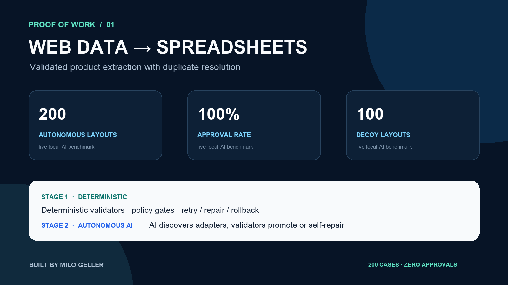

# Autonomous Web Adapter & Spreadsheet Pipeline



[](https://github.com/Milo318/web-data-to-sheets-poc/actions/workflows/ci.yml)

A compact proof of concept for turning supplier-style HTML product pages into validated CSV and Excel workbooks. It resolves duplicate SKUs, normalizes prices and stock values, rejects malformed records, and produces business-ready spreadsheet files.

**Public repository:** https://github.com/Milo318/web-data-to-sheets-poc

> **Data notice:** every product, supplier page, and benchmark input in this repository is synthetic mock data created for demonstration. No real company or customer data is included.

## Autonomous AI proof

The upgraded workflow lets a live local model discover extraction adapters for previously unseen HTML layouts. Deterministic validators then parse a sample and a separate canary page. A mapping is promoted automatically only when required fields, value types, record counts, SKUs, prices, and stock values all pass. Invalid model output is self-repaired from semantic class evidence; no human approval step exists.

The committed [live-model benchmark](proof/autonomous-benchmark.json) and [200 case-level results](proof/autonomous-cases.jsonl) were generated with `granite4.1:3b` through Ollama:

> **How to read 100%:** the model directly mapped all 200 controlled layouts in this run. The reported final result still belongs to the complete system because every mapping had to pass deterministic field checks and separate sample/canary parsing. Expected mappings are used for scoring only, not supplied to the runtime controller; this bounded result is not a universal scraping-accuracy claim.

| Autonomous acceptance check | Result |
|---|---:|
| Independent layouts | 200 |
| Raw AI mappings correct | 200 / 200 |
| Decoy-element stress layouts | 100 / 100 approved |
| Sample + canary records validated | 800 |
| Final machine-approved cases | 200 / 200 |
| Final system approval rate | **100%** |
| Human approvals | **0** |

```bash
python -m web_data_pipeline.autonomous_benchmark --cases 200 --model granite4.1:3b
```

Reproduction requires a running Ollama service with the selected model installed.

Half of the layouts contain plausible archived prices, legacy SKUs, historical stock values, and accessibility notes. The approval rate measures the complete autonomous system, not an unsupported model claim. Every approved case must also match the disclosed generated truth and pass the deterministic canary gate.

## Proof of work

The committed [benchmark result](proof/benchmark.json) was produced locally from the included fixture and can be regenerated:

| Check | Measured result |
|---|---:|
| Parser runs | 250 |
| Records processed | 1,500 |
| Record-count consistency | 100% |
| Median parsing latency | 0.114 ms per six-record page |
| Observed throughput | 51,840 records/second |
| Automated tests | 7 passing |

Performance is a point-in-time measurement on a local machine, not a production capacity promise. The consistency and validation checks are the important proof: the same source produces the same normalized records on every run.

### Reproduce the evidence

```bash
python3 -m venv .venv
source .venv/bin/activate
python -m pip install -e .
python -m unittest discover -s tests -v
python -m web_data_pipeline.cli --input data/mock --output output
python -m web_data_pipeline.benchmark --output proof/benchmark.json
```

Expected demo summary:

```json
{"input_files": 2, "unique_products": 11, "duplicates_resolved": 1, "invalid_rows": 0}
```

The generated `output/products.xlsx` contains a formatted table, filters, frozen headers, and normalized values. `output/products.csv` is ready for Google Sheets import or a downstream API.

## How it works

```text
Mock supplier HTML
        ↓
Contract-specific parser
        ↓
Type and range validation
        ↓
SKU deduplication
        ↓
CSV + formatted XLSX
        ↓ optional
AI category and merchandising enrichment
```

### Stage 1 — deterministic core

The default path needs no API key. Parsing rules are explicit, numeric ranges are validated, duplicate handling is stable, and the export has a fixed schema. This makes the pipeline suitable for repeatable operational work and straightforward debugging.

### Stage 2 — autonomous AI adapter generation

The autonomy layer uses AI to infer field mappings for new layouts, validates them on separate pages, and promotes or repairs them automatically. The existing `--ai` enrichment path can additionally normalize categories and write merchandising notes after factual extraction is complete.

```bash
export LLM_API_KEY="..."
export LLM_MODEL="gpt-4.1-mini"
python -m web_data_pipeline.cli --ai
```

`LLM_API_URL` can point to another compatible provider. AI is deliberately optional: a provider outage cannot prevent the base spreadsheet export.

## Evidence map

- [`data/mock/`](data/mock/) — labeled synthetic supplier pages, including one deliberate duplicate SKU
- [`tests/test_pipeline.py`](tests/test_pipeline.py) — normalization, deduplication, CSV, and XLSX checks
- [`proof/benchmark.json`](proof/benchmark.json) — machine-readable benchmark output
- [`proof/autonomous-benchmark.json`](proof/autonomous-benchmark.json) — live-model acceptance summary
- [`proof/autonomous-cases.jsonl`](proof/autonomous-cases.jsonl) — all 200 case decisions
- [`proof/portfolio-card.png`](proof/portfolio-card.png) — portfolio-ready evidence image
- [GitHub Actions workflow](.github/workflows/ci.yml) — runs tests and a fresh benchmark on every push

## Production extension points

Real deployments would add site-specific adapters, robots/terms review, authenticated requests, change monitoring, rate limits, alerting, and direct Google Sheets credentials. Those concerns are intentionally separated from this bounded proof.

Built by **Milo Geller** · MIT licensed.
